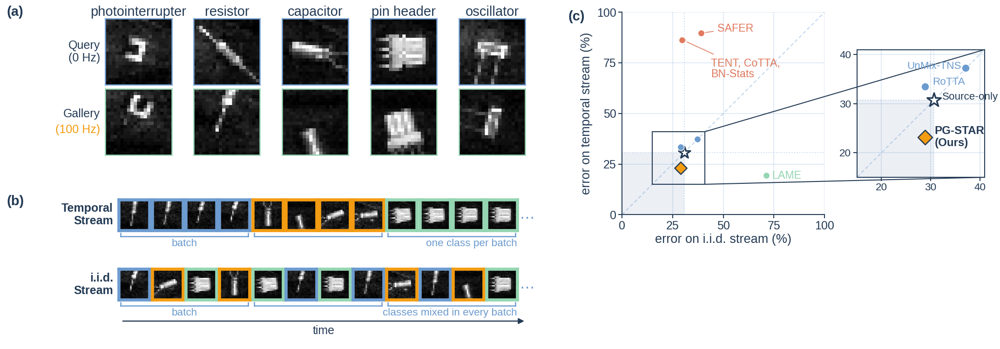
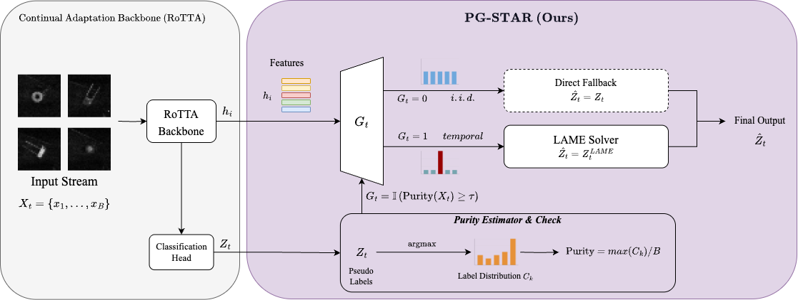

# SPAD-TTA

Repository for **"PG-STAR: Purity-Gated Test-Time Adaption with Dynamic SPAD
Classification for Machine Vision"** (submitted to ICASSP 2027).




SPAD-TTA studies test-time adaptation for a ResNet-50 classifier trained on **static**-acquisition
SPAD (Single-Photon Avalanche Diode) frames of small electronic components, then deployed on a
**dynamic** (100 Hz, spinning-stage) stream of the same physical parts. A source-only classifier
that is accurate on static frames still suffers large errors on the dynamic stream, and existing
online TTA methods swing widely in accuracy depending purely on the *order* frames arrive in — this
repo's benchmark protocol makes that failure mode measurable.

## What's in this release

- The dataset protocol and **six baseline/diagnostic methods**: source-only training, BN
  target-statistics adaptation, TENT, an entropy+consistency ablation, a leave-one-direction-out
  (LODO) viewpoint-generalization study, and a dynamic-oracle supervised reference.
- A **small illustrative sample** of the SPAD-Electronics dataset (~570 static images + ~200
  dynamic images across all 20 classes, plus a 128-row sample of the unlabeled adaptation stream)
  — enough to see the data format and run every script below end-to-end as a smoke test.

**Release after Paper Accepted:**

- **PG-STAR itself** — the paper's proposed method (a purity-gated LAME correction on a RoTTA
  adaptation backbone) and the exact baseline set behind the paper's main results table
  (CoTTA, RoTTA, LAME, UnMix-TNS, SAFER) live in a separate internal module that still needs a
  cleanup pass before release. The `adapt_proposed.py` script in this repo is an **earlier,
  simpler ablation** (entropy minimization + augmentation consistency) that was superseded by
  PG-STAR and is **not** the method reported in the paper's main comparison table — treat it as a
  baseline, not as "the proposed method."
- **The full dataset.** The complete SPAD-Electronics set is 45,851 frames (15,424 static + 30,427
  dynamic) across the same 20 classes. Only a small sample ships here; the sample is sufficient to
  inspect the data layout and smoke-test the code, but **not** to reproduce the paper's reported
  accuracy numbers.

Both will follow in later releases to this same repository.


## Dataset

20 classes of small electronic components, imaged with a passive-mode SPAD array under
constant 800 lux, each frame integrating 40 photon-count exposures of the native 32×32 sensor,
stored as 640×640 grayscale PNGs:

| id | name | id | name | id | name | id | name |
|----|------|----|------|----|------|----|------|
| 1 | inductor | 6 | oscillator | 11 | 3-pin RA header | 16 | optical switch A |
| 2 | resistor | 7 | 4-pin RA header | 12 | straight header | 17 | optical switch B |
| 3 | LED | 8 | 5-pin housing | 13 | vibration switch | 18 | photointerrupter |
| 4 | film capacitor | 9 | USB-C receptacle | 14 | shock sensor | 19 | photodiode |
| 5 | tactile switch | 10 | humidity sensor | 15 | electrolytic cap. | 20 | passive buzzer |

Two acquisition conditions per class: **static** (0 Hz, part at rest, 5 fixed viewing directions)
and **dynamic** (100 Hz, part spinning on a motorized stage). Full-dataset split sizes: static
train/val/test = 9,733 / 2,765 / 2,926 frames (directions 1–3 / 4 / 5); dynamic test = 6,072 frames
(held-out blocks); the remaining dynamic frames form the unlabeled adaptation pool used by the
TTA methods. See `configs/splits.yaml` for the exact protocol definition.

## Repository layout

```
src/tasks/icassp2027/     # six methods + shared data/model/eval code (see below)
configs/                  # protocol (splits.yaml), per-method configs, sample manifests
data/SPAD_Electronics/    # sample static + dynamic images (subset only — see note above)
data_exports/spad_electronics_hf/   # sample of the unlabeled adaptation stream (Parquet, embedded PNG bytes, no labels)
docs/reproducibility_commands.md    # exact commands for every method
```

## Methods

| Script | Method |
|---|---|
| `train_source.py` | Source-only ResNet-50 baseline (static-train only) |
| `adapt_target_stats.py` | BN running-statistics-only adaptation (no gradients) |
| `adapt_tent.py` | TENT — entropy minimization on BN affine parameters |
| `adapt_proposed.py` | Entropy + augmentation-consistency ablation (superseded by PG-STAR — see disclaimer above) |
| `train_lodo_direction.py` | Leave-one-viewing-direction-out generalization diagnostic |
| `train_dynamic_oracle.py` | Supervised reference trained directly on (labeled) dynamic frames — needs the full dataset, not runnable against the sample |
| `evaluate.py` / `evaluate_lodo_direction.py` | Shared evaluators |

## Quickstart (smoke test against the sample data)

```bash
pip install -r requirements.txt

# Source-only baseline, 2-epoch pipeline check against the sample data
python -m src.tasks.icassp2027.train_source --config configs/source_only_resnet50.yaml --seed 0 --smoke

# TENT adaptation against the sample of the unlabeled adaptation stream
python -m src.tasks.icassp2027.adapt_tent --config configs/tent_resnet50.yaml --seed 0 --variant natural --limit 32
```

Every script accepts `--smoke` or `--limit` for a fast pipeline check; see
`docs/reproducibility_commands.md` for the full command set and what each flag does.
`train_dynamic_oracle.py` reads the full unlabeled dynamic pool directly off disk and will raise
`FileNotFoundError` against the sample export — it needs the full dataset release.

## Citation

The paper is currently under review; a full citation will be added once it is published. In the
meantime:

```bibtex
@misc{tsai2027pgstar,
  title  = {PG-STAR: Purity-Gated Test-Time Adaption with Dynamic SPAD Classification for Machine Vision},
  author = {Tsai, Jui-Huang and Hung, Yi-Ching and Lin, Jia-Yu and Lee, Chen-Yi},
  note   = {Submitted to ICASSP 2027},
  year   = {2026}
}
```

## License

Code and sample data in this repository are released under **CC BY-NC 4.0** (non-commercial,
academic use) — see `LICENSE`.
